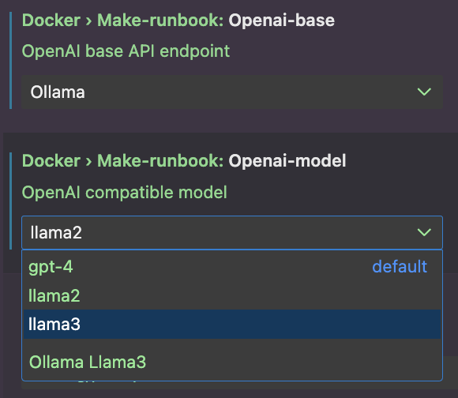

# Docker Runbook Generator

The Docker Runbook Generator is a standalone VSCode extension to add additional runbook features on top of the experimental [Docker-VScode](https://github.com/docker/docker-vscode/) extension. 

## What is this project?

"Make Runbook" uses generative AI and project analysis to generate a Docker specific runbook-style `README.md` to your project. 

See the following for an example:


## Getting started

**Dependency:**
[Docker-VSCode](https://github.com/docker/docker-vscode) alpha version [(installation instructions)](https://github.com/docker/docker-vscode/tree/main/lsp)

1. Install latest VSIX file https://github.com/docker/labs-make-runbook/releases
2. Open Workspace
3. Configure OpenAI API key in VSCode settings: `docker.make-runbook.openai` 
4. Execute command `>Generate a runbook for this project`

This project is a research prototype. It is ready to try and will give results for any project you try it on.

We are still actively working on the prompt engineering.

## Development

### Ollama support
We use the OpenAI Typescript client, meaning all OpenAI compatible models can be used. 

Configure the model and endpoint using settings
`docker.make-runbook.openai-base` and `docker.make-runbook.openai-model`



### Changing prompts
See [prompts README](./prompts/README.md).

### Local developement

```sh
# docker:command=build-and-install
npm run package
code --install-extension make-runbook-0.0.6.vsix
```
